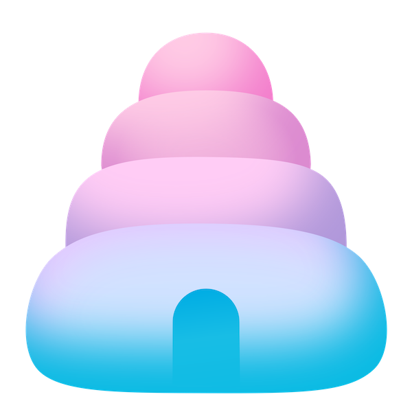

<div align="center">

# Bubblon

[](https://github.com/donderom/bubblon/releases)
[](https://pkg.go.dev/github.com/donderom/bubblon)
[](https://github.com/donderom/bubblon/actions/workflows/build.yml)
[](https://github.com/donderom/bubblon/blob/main/LICENSE)
[](https://goreportcard.com/report/donderom/bubblon)


</div>

Bubblon is a solution for managing nested [Bubble Tea](https://github.com/charmbracelet/bubbletea) models (or views/screens). This is a typical use case in TUIs, such as navigating from a main list to a sublist when an item is selected. The "canonical" way to structure this is with a [view-switching model](https://www.youtube.com/watch?v=uJ2egAkSkjg), where you keep track which view you're in (e.g., `main` or `sub`) and what item is selected, then render the appropriate model(s) for that view.

 By contrast, Bubblon uses a "model stack" architecture, where the controller determines the current model. Instead of bloating a single `Model` with state for everything, you encapsulate each view in its own `tea.Model` with its own `Update()`, `View()`, and logic. The controller then pushes/pops models on a stack as the user navigates.

### Features

* **Modular**: Each view is self-contained. Rendering another model is one line away.
* **Reusability** of sub-models due to way less coupling between models.
* **Easier to reason about**, especially when state gets complex. Instead of adding more and more state to manage, it can be passed to the new model so that each model is responsible only for its own state.
* **No new interfaces**: Keeps complexity low by avoiding new abstractions (the models should implement the `tea.Model` interface only).

Note that the stack approach is suitable only for "fullscreen" views or views that render on top of each other.

## Installation

To install Bubblon, use `go get`:

```sh
go get github.com/donderom/bubblon
```

Import the `bubblon` package into your code:

```sh
import "github.com/donderom/bubblon"
```

## Usage

To run the controller, update the Bubble Tea program initialization from:

```go
mainModel := MainModel.New()
program := tea.NewProgram(mainModel, tea.WithAltScreen()) 
```

to:

```go
...
import "github.com/donderom/bubblon"
 
mainModel := MainModel.New()
controller, err := bubblon.New(mainModel)
program := tea.NewProgram(controller, tea.WithAltScreen()) 
```

At any point within the `MainModel`, you can open a new model by sending a `bubblon.Open()` command:

```go
func (m MainModel) Update(msg tea.Msg) (tea.Model, tea.Cmd) {
...
  return m, bubblon.Open(SubModel.New())
```

There are no requirements other than for `MainModel` and `SubModel` to implement the `tea.Model` interface.

To close the current view and return to the previous one, send the `bubblon.Close` command:

```go
func (m SubModel) Update(msg tea.Msg) (tea.Model, tea.Cmd) {
...
  return m, bubblon.Close
```

When the `SubModel` is closed, the `MainModel` will receive a `bubblon.Closed` message.

The whole navigation is based on these two commands.

### Model replacement

The `bubblon.Replace` command replaces the current model with a new one:

```go
func (m MainModel) Update(msg tea.Msg) (tea.Model, tea.Cmd) {
...
  return m, bubblon.Replace(newModel)
```

It can be thought of as a combination of `bubblon.Close` followed by `bubblon.Open`, but it's internally optimized for performance.

While `bubblon.Replace` replaces only the current model, `bubblon.ReplaceAll` replaces all models with a new one:

```go

func (m MainModel) Update(msg tea.Msg) (tea.Model, tea.Cmd) {
...
  return m, bubblon.ReplaceAll(newModel)
```

### Error propagation

Sending the `bubblon.Fail` message will cause the app to exit and populate the `Err` field, which can be accessed after the program terminates for logging, etc.

From any model managed by `bubblon`:

```go
func (m SomeModel) Update(msg tea.Msg) (tea.Mode, tea.Cmd) {
...
	err := ...
	if err != nil {
		return m, bubblon.Fail(err)
	}
}
```

Handle the error after program termination:

```go
import "github.com/donderom/bubblon"

controller, _ := bubblon.New(SomeModel.New())
program := tea.NewProgram(controller, tea.WithAltScreen())
m, _ := p.Run()

if m, ok := m.(bubblon.Controller); ok && m.Err != nil {
	log.Fatal(m.Err)
}
```

### Send a message on open/close

To send a message to a newly opened model or to the parent model after closing a nested one, use the regular `tea.Sequence` command:

```go
return m, tea.Sequence(bubblon.Open(model), messageOnOpen)
```

```go
return m, tea.Sequence(bubblon.Close, messageOnClose)
```

## License

[MIT](https://github.com/donderom/bubblon/raw/main/LICENSE)
